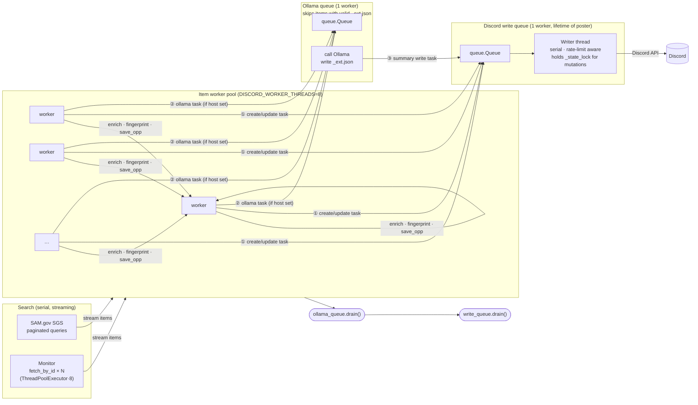

# samgov-sync — App Flow

## Current implementation



**Ordering guarantee.** Each item enqueues its Discord create/update task **①** before its Ollama task **②**. Ollama only enqueues the summary write **③** after inference completes. Since the Discord write queue is FIFO and serial, create/update always executes before summary for the same item — no explicit drain barrier needed between them.

**Drain order.** After the item pool:
1. `ollama_queue.drain()` — all pending inference runs; summary write tasks land on Discord queue.
2. `write_queue.drain()` — all remaining Discord API calls (creates, updates, summaries) complete.

## Concurrency summary

| Stage | Workers | Bottleneck |
|---|---|---|
| Search | 1 (serial) | SAM.gov pagination |
| Monitor fetch_by_id | 8 | SAM.gov API I/O |
| Item enrichment | 8 (`DISCORD_WORKER_THREADS`) | SAM.gov API I/O |
| Ollama inference | 1 | GPU / local LLM |
| Discord API writes | 1 | Discord rate limits |

## State files

```
state/
  .discord_state_{channel_id}.json   # thread/message IDs, fingerprints, active flags
  opps/
    {noticeId}.json                  # raw mapped fields (written on create/update)
    {noticeId}_ext.json              # Ollama output: summary + deliverables
                                     # queue skips this item if summary key is not None
```
